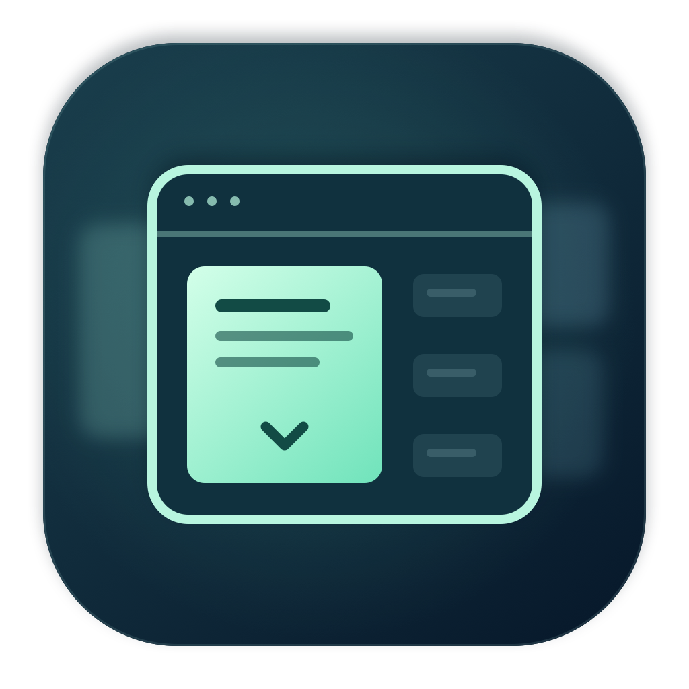

# Heads Down identity



An original focus-window mark: one crisp mint panel, subdued surrounding content,
and a small downward chevron. The rounded navy tile is the macOS app icon.

## Files

- `heads-down-icon.png`: full-resolution 1024×1024 artwork, with transparent margins.
- `../app/HeadsDown/Assets.xcassets/AppIcon.appiconset/`: all ten macOS icon slots (16–1024 px).
- `../app/HeadsDown/Assets.xcassets/BrandIcon.imageset/`: color mark for the menu-panel header.
- `../app/HeadsDown/Assets.xcassets/MenuBarIcon.imageset/`: outlined idle mark.
- `../app/HeadsDown/Assets.xcassets/MenuBarActive.imageset/`: filled active mark.

The menu-bar marks are monochrome template images, so macOS supplies the correct
color for light/dark menu bars. Existing pause, timer, permission, and error symbols
remain in use for those states; accessible labels include the current app status.

## Editable artwork and regeneration

The vector drawing source is `../app/scripts/generate-brand-assets.swift`.
It uses only native Core Graphics / Core Image; no external font, image, or download.

From the repository root:

```bash
swift app/scripts/generate-brand-assets.swift
```

Generated PNGs and asset manifests are included directly in the app. Regeneration
is not a build step. The app's menu-bar-only behavior is unchanged (no Dock icon).

Palette: deep navy `#081A2C`, blue-green `#193D4B`, pale mint `#D3FFE9`,
bright mint `#70E3BB`, and dark ink `#124B45`.
